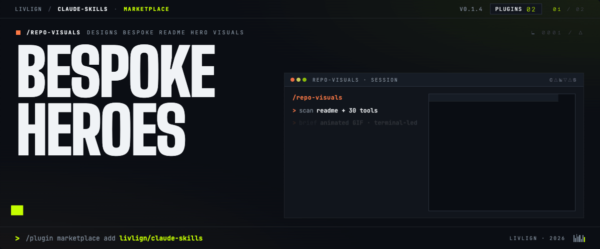

# repo-visuals



A Claude Code skill for producing hero visuals — **animated GIF** or **static PNG** — for GitHub repositories.

The skill scans the target repo, recommends a format (animated vs static) based on the repo's identity, then generates bespoke HTML per repo via a structured discovery dialog, previews it in the browser, and exports to an optimized GIF or retina PNG. The user picks an operating mode at the start (Auto / Semi-auto / Manual) to control how many decisions the skill asks before shipping.

## Install

Installed as a **user-level** Claude Code skill at `~/.claude/skills/repo-visuals`, it's available in every project on your machine.

Prerequisites (all platforms): Node.js 18+, git, and ffmpeg (installed below).

### macOS

```bash
mkdir -p ~/.claude/skills \
  && git clone https://github.com/livlign/repo-visuals.git ~/.claude/skills/repo-visuals \
  && cd ~/.claude/skills/repo-visuals \
  && npm install \
  && brew install ffmpeg
```

If you've already cloned the repo elsewhere and want to symlink it instead of a second clone:

```bash
mkdir -p ~/.claude/skills && ln -s "$(pwd)" ~/.claude/skills/repo-visuals && npm install
```

### Linux (Debian / Ubuntu)

```bash
mkdir -p ~/.claude/skills \
  && git clone https://github.com/livlign/repo-visuals.git ~/.claude/skills/repo-visuals \
  && cd ~/.claude/skills/repo-visuals \
  && npm install \
  && sudo apt install -y ffmpeg
```

Other distros: swap in `dnf install ffmpeg` (Fedora), `pacman -S ffmpeg` (Arch), etc.

### Windows — PowerShell

```powershell
New-Item -ItemType Directory -Force -Path "$HOME\.claude\skills" | Out-Null
git clone https://github.com/livlign/repo-visuals.git "$HOME\.claude\skills\repo-visuals"
cd "$HOME\.claude\skills\repo-visuals"
npm install
choco install ffmpeg    # or: winget install Gyan.FFmpeg
```

### Windows — Git Bash / WSL

Use the **Linux** commands above. WSL runs under its own home directory (`~` inside WSL is not the same as `C:\Users\<you>`) — make sure Claude Code is also running inside WSL so it reads the same `~/.claude/skills/`.

### After installing

Restart Claude Code (or start a new session) — the skill is auto-discovered. Invoke it by asking Claude to "make a hero visual for this repo," or run `/repo-visuals` directly.

### Updating to a newer version

```bash
cd ~/.claude/skills/repo-visuals && git pull && npm install
```

Then restart Claude Code (or start a new session) so the updated `SKILL.md` is re-read. If you symlinked from a clone elsewhere, run the same commands in that clone.

## Getting started

1. Invoke the skill and give it a target: a GitHub URL, a local path, or a free-text brief.
2. Pick an operating mode when prompted (see below).
3. Follow the discovery dialog through to export. The skill handles scan → scenario → brief → build → preview → export → evaluate.

## Operating modes

At the start of every run the skill asks (via `AskUserQuestion`) which mode to run in. The mode controls **how many decisions the skill asks the user to make** before shipping an artifact — it does **not** relax any craft rules (real-inventory count, scope match, Code + AI eval always run).

| Mode | What **you** decide | What **Claude** decides silently | Phase 6 scorecard | Typical back-and-forths |
|---|---|---|---|---|
| **Auto** | nothing | everything (format, scenario, vibe, audience, dimensions, copy, ship) | Code + AI + Claude rows only (no User ratings) | 0 |
| **Semi-auto** _(default)_ | output format (GIF/PNG/HTML), one preview-and-iterate review, User scorecard | scenario, vibe, audience, dimensions, copy | full 4-rater scorecard | ~3 |
| **Manual** | every decision point — scenario pick, vibe, brief approval, preview iteration rounds, ship intent, full scorecard | nothing (Claude still suggests and recommends at each step) | full 4-rater scorecard | 8–12 |

### Which to pick

- **Auto** — hands-off draft. Pros: fastest path to a shippable artifact; zero decisions. Cons: lower ceiling on quality; higher risk of missing your taste or the repo's real scope. Best when you want a starting point to react against, not a finished product.
- **Semi-auto** — the recommended default. Pros: fast, keeps the production-grade preview gate, keeps your taste in the loop on the decisions that matter most (format, final review, scorecard). Cons: you don't get input on the smaller creative calls.
- **Manual** — full control. Pros: highest ceiling on quality; your voice present at every beat. Cons: slow — expect 8–12 back-and-forths before an artifact lands.

Any mode can be upgraded mid-run — say *"stop, switch to semi"* and the skill resumes from the nearest unanswered decision point without re-asking what you've already settled.

## Layout

- [`SKILL.md`](./SKILL.md) — main skill definition (discovery → build → preview → export → output → evaluate).
- [`craft/`](./craft/) — craft library consulted during builds.
  - [`craft/headlines.md`](./craft/headlines.md) — headline patterns, voice rules, anti-patterns.
  - [`craft/reference-gallery.md`](./craft/reference-gallery.md) — catalogued archetypes from real-world repo heroes; consulted during format recommendation (§1.4c).
  - [`craft/templates/`](./craft/templates/) — full working heroes to reference when composing scene systems.
- [`scripts/`](./scripts/) — export pipeline + evaluator.
  - `capture.js` — animated capture via Puppeteer `Page.startScreencast` + ffmpeg palette recipe.
  - `screenshot.js` — static capture via Puppeteer `page.screenshot` at `deviceScaleFactor: 2`.
  - `evaluate.js` — Phase 6 code-evaluated scorecard rows (format-aware).
- [`repo-visuals-retro/`](./repo-visuals-retro/) — retrospective meta-skill that reads evaluation logs and proposes edits to `SKILL.md`. Invoked on-demand, not per run.
- `evaluations/runs/` — gitignored per-run raw scorecards.
- `evaluations/index.md` — curated aggregate across runs.

## Dependencies

- Node.js
- `puppeteer` — auto-installed via `npm install` (~170 MB Chromium on first run).
- `ffmpeg` + `ffprobe` — system install (`brew install ffmpeg`, `apt install ffmpeg`, `choco install ffmpeg`) or portable binaries in `./bin/`. See `SKILL.md` §4.1.
- `gifsicle` — optional; enables GIF palette-size checks in `scripts/evaluate.js`.
